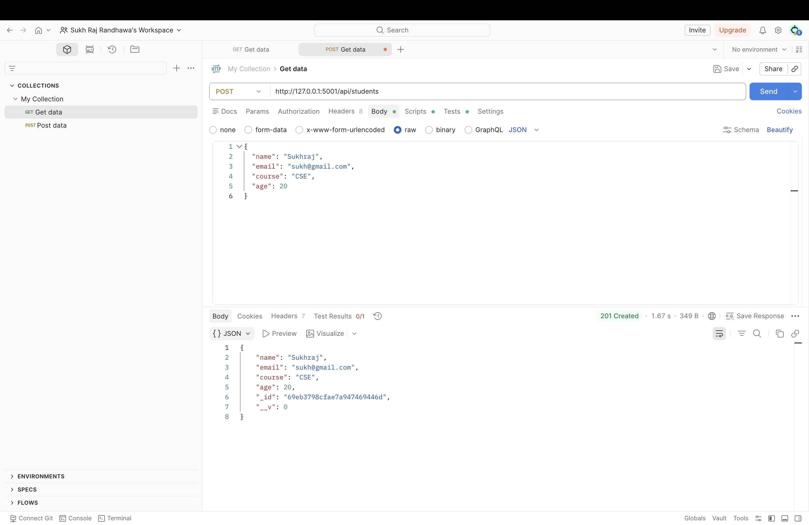
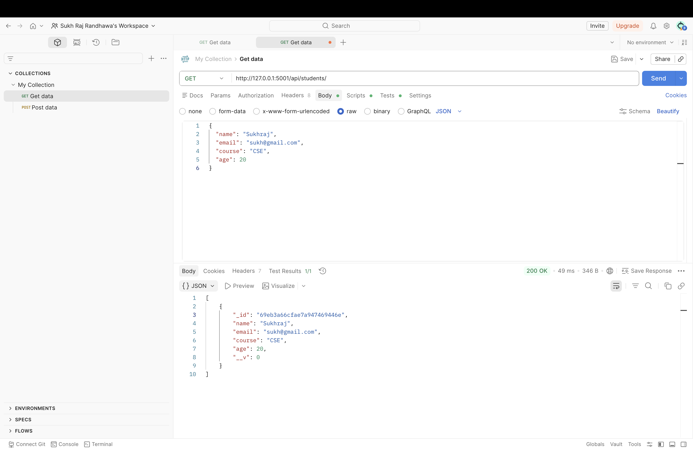
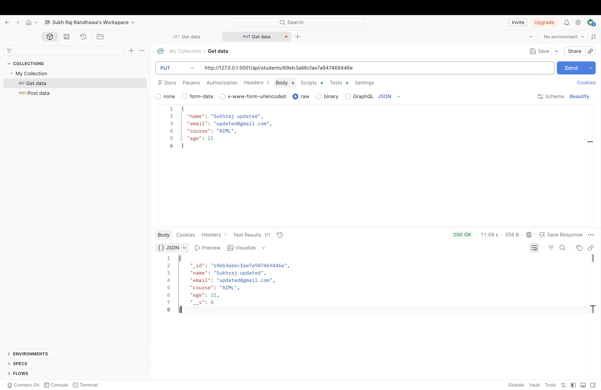
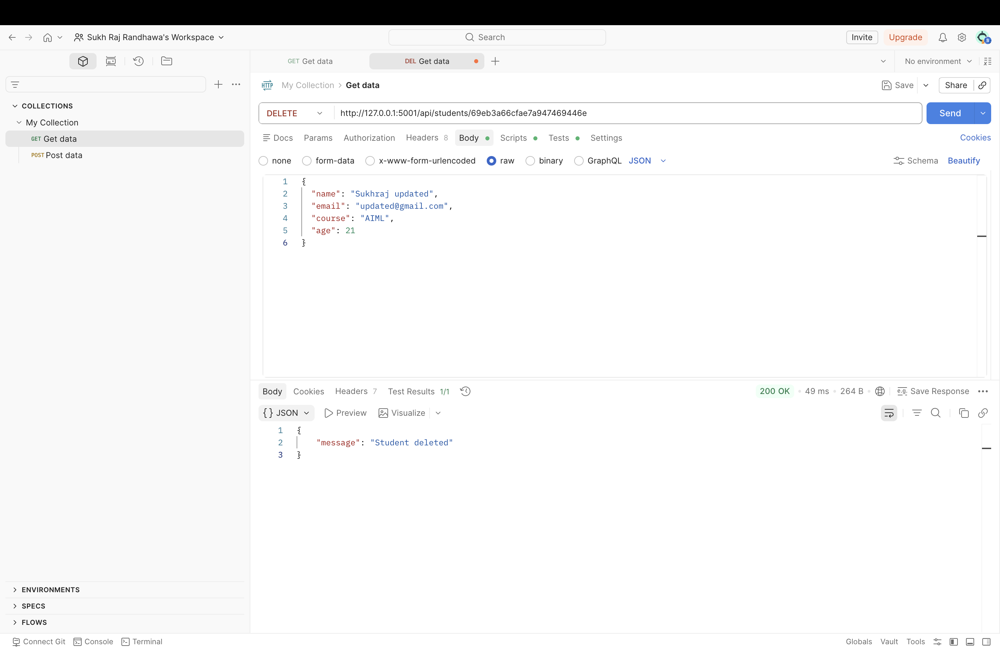
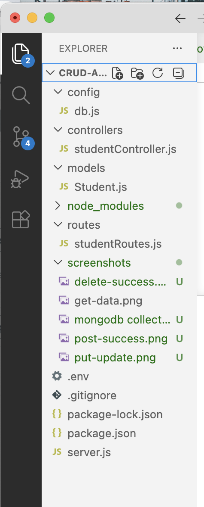

# CRUD API using Node.js, Express & MongoDB

## 📌 Project Description
This project is a RESTful CRUD API built using Node.js, Express, and MongoDB. It allows users to create, read, update, and delete student data.

---

## 🚀 Tech Stack
- Node.js
- Express.js
- MongoDB (Atlas)
- Mongoose
- Postman (for testing)

---

## 📂 Folder Structure
- config/ → Database connection
- controllers/ → Business logic
- models/ → Schema (Student)
- routes/ → API routes
- screenshots/ → API testing proof

---

## 🔗 API Endpoints

### ➤ Create Student
POST `/api/students`

### ➤ Get All Students
GET `/api/students`

### ➤ Update Student
PUT `/api/students/:id`

### ➤ Delete Student
DELETE `/api/students/:id`

---

## 📸 Screenshots

### POST (Create)

### GET (Read)

### PUT (Update)

### DELETE (Delete)

### MongoDB Collection

### Folder Structure

---

## ✅ Result
All CRUD operations were successfully tested using Postman and data was stored in MongoDB Atlas.

---

## 👩‍💻 Author
Sukh Raj Randhawa
